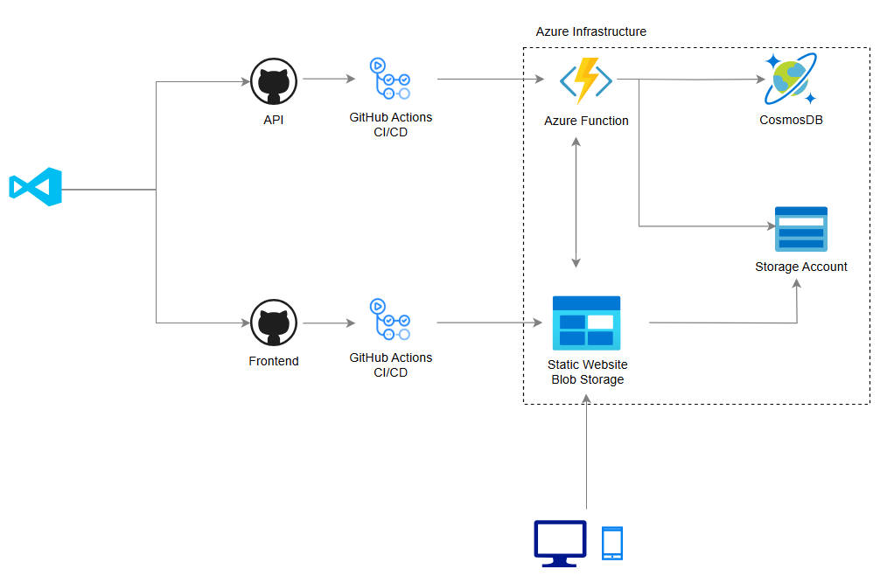

# Azure Cloud Resume Challenge

Welcome to my Cloud Resume Challenge repository! This project showcases my professional skills and personal projects. It includes a React-based frontend website, an API built with .NET 8, and integration with Azure Functions and Cosmos DB to handle .

## Features
- **React Frontend**: A modern, responsive, and interactive user interface.
- **.NET 8 API**: A robust backend service to handle portfolio data.
- **Azure Functions**: Serverless functions for efficient and scalable API endpoints.
- **Cosmos DB**: A globally distributed, multi-model database for storing portfolio data.

## Live Demo
[View Portfolio](https://ed-henriquez.com/) 

---

## Architecture

## Getting Started

### Prerequisites

- **Node.js** (v16+)
- **.NET 8 SDK**
- **Azure CLI**
- **Cosmos DB instance**

---

### Deployment

- **Frontend**: Deployed to an Azure Static Web App
- **Backend**: Publish the .NET API to Azure App Service.
- **Azure Functions**: Deploy using the Azure CLI or Visual Studio Code.

---

## Resources
Here are some of the resources I used during this project:

- [Azure Functions Cosmos DB bindings](https://docs.microsoft.com/en-us/azure/azure-functions/functions-bindings-cosmosdb-v2)
- [Retrieve a Cosmos DB item with Functions binding.](https://docs.microsoft.com/azure/azure-functions/functions-bindings-cosmosdb-v2-input?tabs=csharp)
- [Write to a Cosmos DB item with Functions binding.](https://docs.microsoft.com/azure/azure-functions/functions-bindings-cosmosdb-v2-output?tabs=csharp)
- You'll have to [enable CORS with Azure Functions locally](https://learn.microsoft.com/azure/azure-functions/functions-develop-local#local-settings-file) and once it's [deployed to Azure](https://docs.microsoft.com/azure/azure-functions/functions-how-to-use-azure-function-app-settings?tabs=portal#cors) for you website to be able to call it.
- Deploy a blob storage static site with [GitHub actions.](https://docs.microsoft.com/azure/storage/blobs/storage-blobs-static-site-github-actions)
- [deploy an Azure Function to Azure with GitHub Actions.](https://github.com/marketplace/actions/azure-functions-action)

---

## License

This project is licensed under the MIT License. See the [LICENSE](LICENSE) file for details.

---

## Acknowledgments

- Thanks to the open-source community for inspiring and enabling this project.
- Special thanks to [Resource Name/Contributor] for their support.
